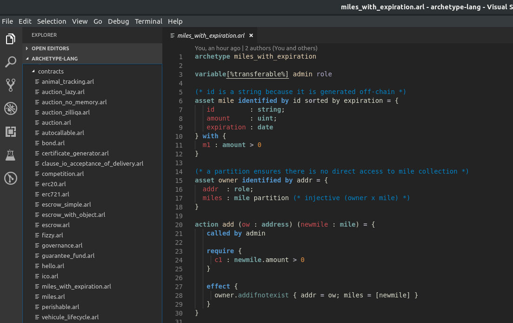

# Archetype support for Visual Studio code

Archetype is a smart contract development solution dedicated to contract quality insurance, this extension provides:

## Screenshot

## Feature

- [X] Syntax highlighting
- [X] Snippets
- [X] Icons for archetype files
- [ ] Code navigation
- [ ] Hover Information
- [ ] Refactoring
- [ ] Formatting
- [ ] Auto-Completion
- [ ] Outline
- [ ] Linter

## Release Notes

### 0.0.1

Add syntax highlighting.
